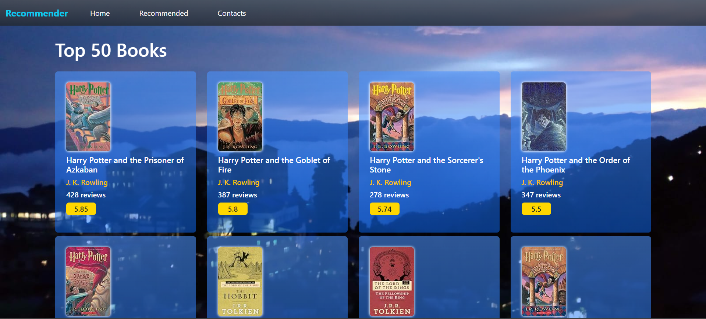

# Book Recommender System

This is a book recommender website created using the **Flask** framework that makes book recommendations to the user based on a dataset from **Kaggle**.

## Features

* **Top 50** books from the dataset based on **average ratings** are displayed on the **home** route.
* Based on the user input, **Top 5** recommendations are displayed on the `/recommend` route.

## Dataset link
[Book Recommendation Dataset](https://www.kaggle.com/datasets/arashnic/book-recommendation-dataset)

## Deployment link
[Book Recommender System](https://book-recommender-system-olce.onrender.com/)